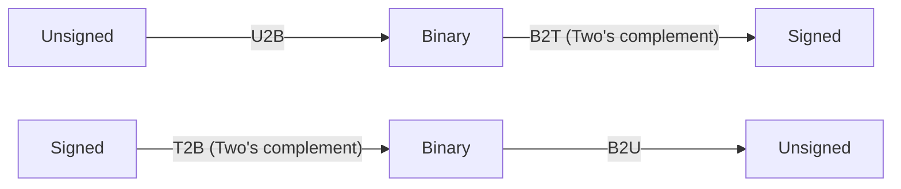
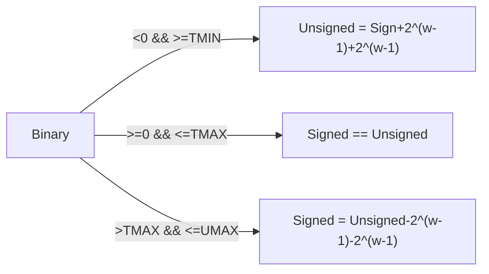

# ICS:Arithmetic

----|------Signed------|------Signed & Unsigned------|------Unsigned------|----  
[TMIN]&emsp;&emsp;&emsp;&emsp;&emsp;&nbsp;[0]&emsp;&emsp;&emsp;&emsp;&emsp;&emsp;&emsp;&emsp;&emsp;&emsp;&ensp;[TMAX]&emsp;&emsp;&emsp;&emsp;&emsp;[UMAX]

