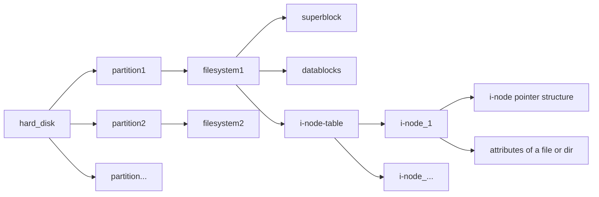

# File

#### The i-node pointer structure (NOT i-node table)

### Caution
 - The inode (index node) is a data structure in a Unix-style file system that describes a file-system object such as a file or a directory. Each inode stores the attributes and disk block locations of the object's data. File-system object attributes may include metadata (times of last change,[2] access, modification), as well as owner and permission data. Directories are lists of names assigned to inodes. A directory contains an entry for itself, its parent, and each of its children.
 - Each i-node has a table which contains 13 blocks
 - Each **Block** indicates a **Data Block** which either stores **data** or **i-nodes**(for large file of course) 
 - **Superblock** stores meta data of the filesystem
 - **Datablocks** stores actual data
 - **i-node** stores the attributes and disk block locations(datablock) of the object's data
 - A **file** corresponds to a **i-node**

### Link
 - **Soft Link** : Indicates a **file name** (if the name of source flie is changed, the Link is over)
 - **Hard Link** : Indicates a **i-node** (the Link still functions even the source file is deleted)
 - Each i-node has a table which contains 13 blocks
 - Each **Block** indicates a **Data Block** which either stores **data** or **i-nodes**(for large file of course) 

### Directory
- **Directory** is a list which contains **file name** and its corresponding **i-node** 
- A **Directory** is a mount point for a **filesystem**

### Links
- **Hard Link** is another reference to the i-node whereas **Soft Link** is a reference to a path.
- Creating **Hard Link** would result the increase of the links number, but once links number drops down to 0, the actual data of the file will be free. 

### Device
- Each **Device** has its corresponding **Device Driver** 
> a device driver is a computer program that operates or controls a particular type of device that is attached to a computer
- For example, the system call - read, every time the read is called, the following steps would be proceeded:
	- 1.Kernel examines the i-node through the file descriptor.
	- 2.Kernel figures out what kind of the file is (property 'st_mode' in struct 'stat'). 
	- 3.Kernel call the corresponding **Device Driver**'s read funciton to read (in this case, the driver is ?).
- There are different sets of properties for different kind of files (e.g, buffer for **Disk file**), which can be alter or acquire by function **fcntl()** or **ioctl()** ( fcntl() acts only on **FILES** whereas ioctl() acts on both **FILES** and **DEVICES** ).

[More info of file system](https://tldp.org/LDP/intro-linux/html/sect_03_01.html)
